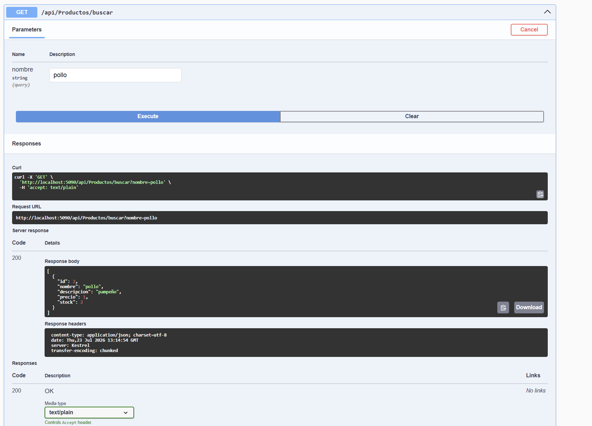

# Productos API — Segundo Parcial Programación Web II

Módulo Productos desarrollado con ASP.NET Core Web API 8, Entity Framework Core, SQL Server y Swagger. Todas las operaciones se realizan contra SQL Server mediante EF Core (no hay listas locales ni datos simulados).

## Tecnologías

- ASP.NET Core Web API (.NET 8)
- Entity Framework Core 8 (SqlServer, Tools, Design)
- SQL Server (`Macrosboy\SQL_DEV`)
- Swagger (Swashbuckle.AspNetCore)

## Estructura del modelo `Producto`

| Campo       | Tipo    | Descripción                          |
|-------------|---------|--------------------------------------|
| Id          | int     | Clave primaria (autoincremental)     |
| Nombre      | string  | Obligatorio, máx. 100 caracteres     |
| Descripcion | string? | Opcional, máx. 250 caracteres        |
| Precio      | decimal | Mayor a 0, decimal(18,2)             |
| Stock       | int     | Mayor o igual a 0                    |

## Cadena de conexión

En `appsettings.json`:

```json
"Server=Macrosboy\\SQL_DEV;Database=ProductosDB;Trusted_Connection=True;TrustServerCertificate=True;MultipleActiveResultSets=true"


<table>
  <tr>
    <td align="center" width="50%"><b>01. GET — Listar Todos los Productos</b></td>
    <td align="center" width="50%"><b>02. POST — Registrar Nuevo Producto</b></td>
  </tr>
  <tr>
    <td></td>
    <td></td>
  </tr>
  <tr>
    <td>Consulta general <code>200 OK</code> retornando el catálogo completo en formato JSON.</td>
    <td>Registro exitoso <code>201 Created</code> agregando un nuevo producto ("Audífonos Gamer").</td>
  </tr>
  <tr>
    <td align="center" width="50%"><b>03. GET por ID — Consultar Registro Específico</b></td>
    <td align="center" width="50%"><b>04. GET por Nombre — Búsqueda de Productos</b></td>
  </tr>
  <tr>
    <td></td>
    <td></td>
  </tr>
  <tr>
    <td>Búsqueda directa <code>200 OK</code> filtrando por ID (ej. ID 1).</td>
    <td>Búsqueda <code>200 OK</code> mediante parámetro query (ej. "Mouse Inalámbrico").</td>
  </tr>
  <tr>
    <td align="center" width="50%"><b>05. PUT — Actualizar Datos de Producto</b></td>
    <td align="center" width="50%"><b>06. GET por ID — Verificar Modificación</b></td>
  </tr>
  <tr>
    <td></td>
    <td></td>
  </tr>
  <tr>
    <td>Modificación exitosa <code>204 No Content</code> cambiando datos del registro ID 4 ("Silla Gamer").</td>
    <td>Verificación <code>200 OK</code> del recurso actualizado correctamente.</td>
  </tr>
  <tr>
    <td align="center" width="50%"><b>07. DELETE — Eliminar Registro</b></td>
    <td align="center" width="50%"><b>08. GET por ID — Validar Error 404 (Not Found)</b></td>
  </tr>
  <tr>
    <td></td>
    <td></td>
  </tr>
  <tr>
    <td>Eliminación exitosa <code>204 No Content</code> del registro con ID 1.</td>
    <td>Respuesta controlada <code>404 Not Found</code> confirmando que el ID 1 ya no existe.</td>
  </tr>
</table>


