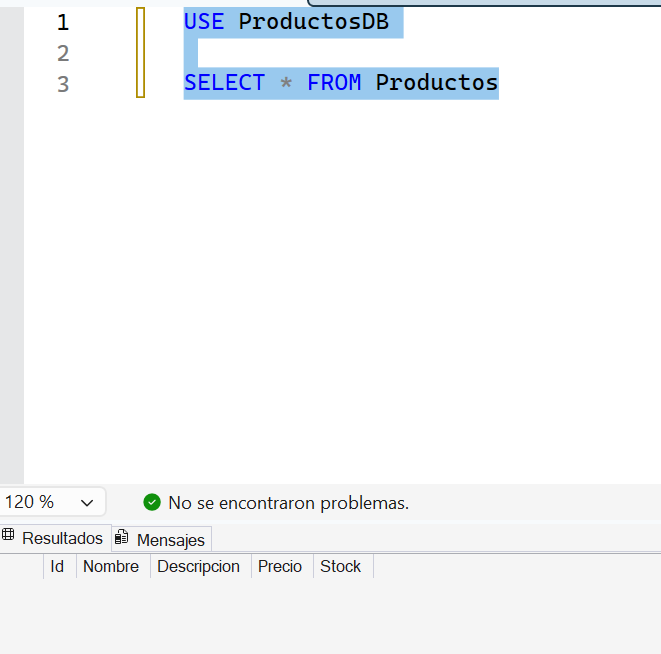
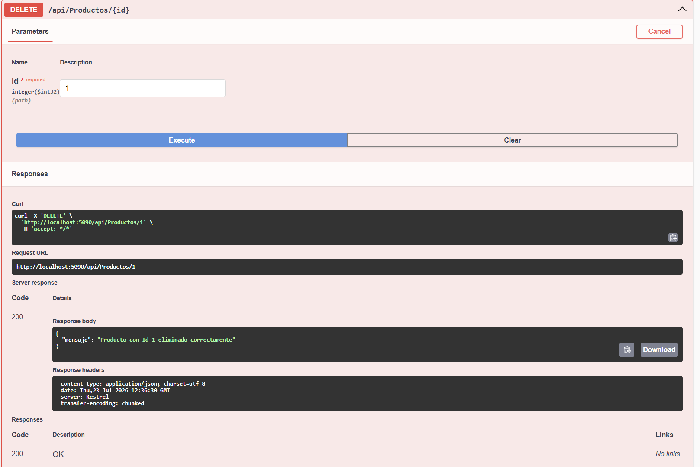
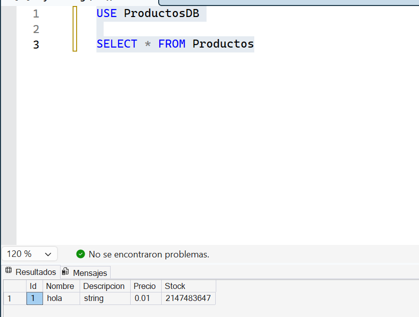
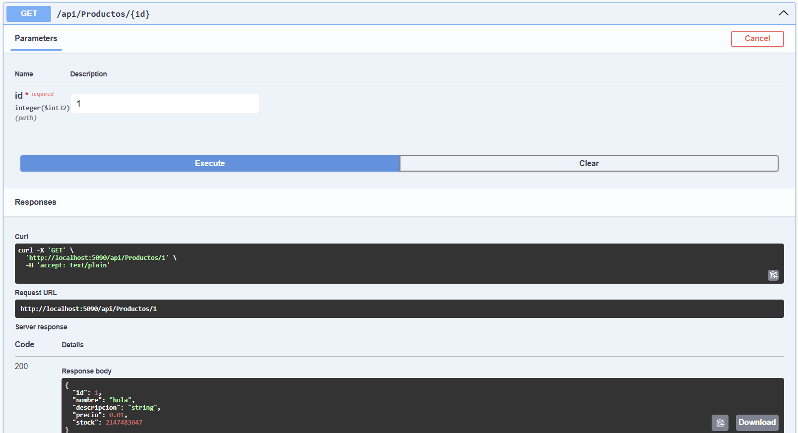
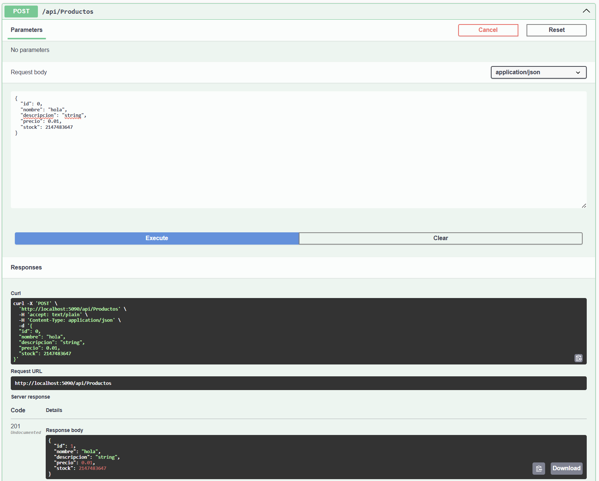
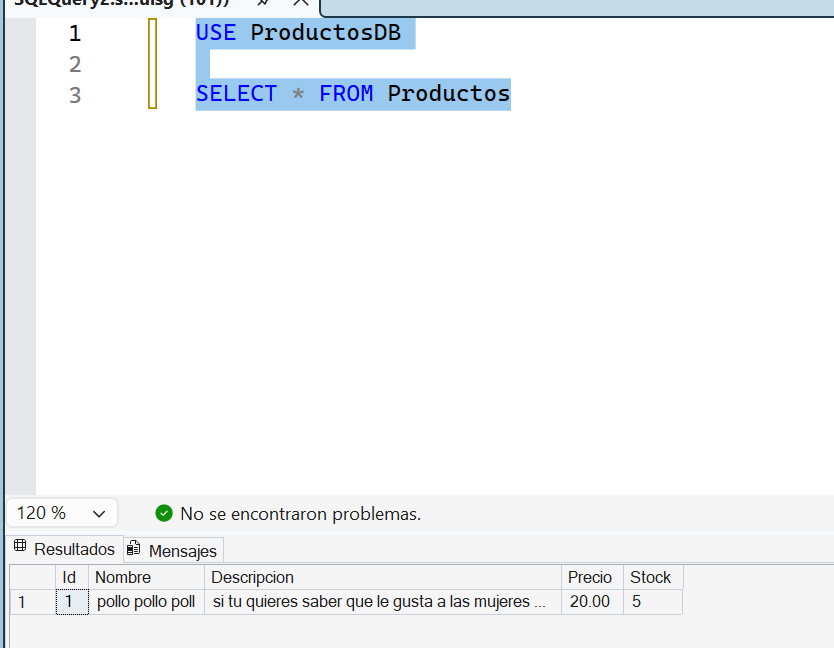
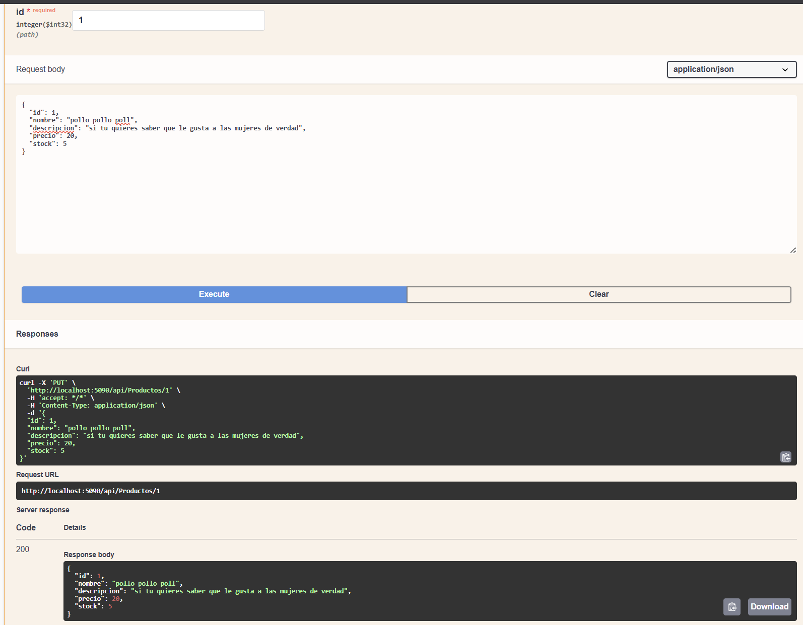

# Productos API — Segundo Parcial Programación Web II

Módulo Productos desarrollado con ASP.NET Core Web API 8, Entity Framework Core, SQL Server y Swagger. Todas las operaciones se realizan contra SQL Server mediante EF Core (no hay listas locales ni datos simulados).

## Tecnologías

- ASP.NET Core Web API (.NET 8)
- Entity Framework Core 8 (SqlServer, Tools, Design)
- SQL Server (`Macrosboy\SQL_DEV`)
- Swagger (Swashbuckle.AspNetCore)

## Estructura del modelo `Producto`

| Campo       | Tipo    | Descripción                          |
|-------------|---------|--------------------------------------|
| Id          | int     | Clave primaria (autoincremental)     |
| Nombre      | string  | Obligatorio, máx. 100 caracteres     |
| Descripcion | string? | Opcional, máx. 250 caracteres        |
| Precio      | decimal | Mayor a 0, decimal(18,2)             |
| Stock       | int     | Mayor o igual a 0                    |

## Cadena de conexión

En `appsettings.json`:

```json
"Server=Macrosboy\\SQL_DEV;Database=ProductosDB;Trusted_Connection=True;TrustServerCertificate=True;MultipleActiveResultSets=true"
```

<table>

  <tr>
    <td></td>
    <td></td>
  </tr>
 
 
  <tr>
    <td></td>
    <td></td>
  </tr>
  
  
  <tr>
    <td></td>
    <td></td>
  </tr>
  
 
  <tr>
    <td></td>
    <td></td>
  </tr>
  
</table>


